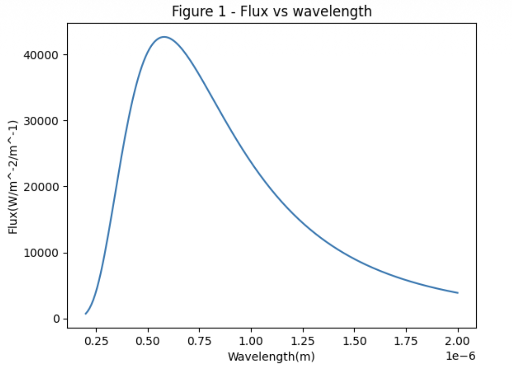
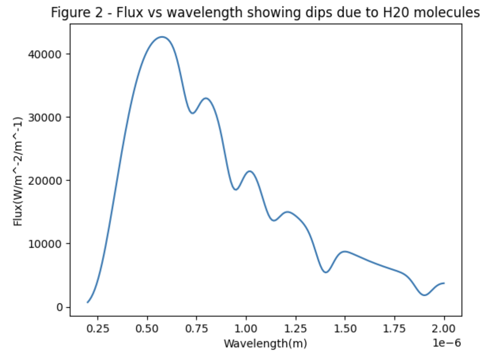
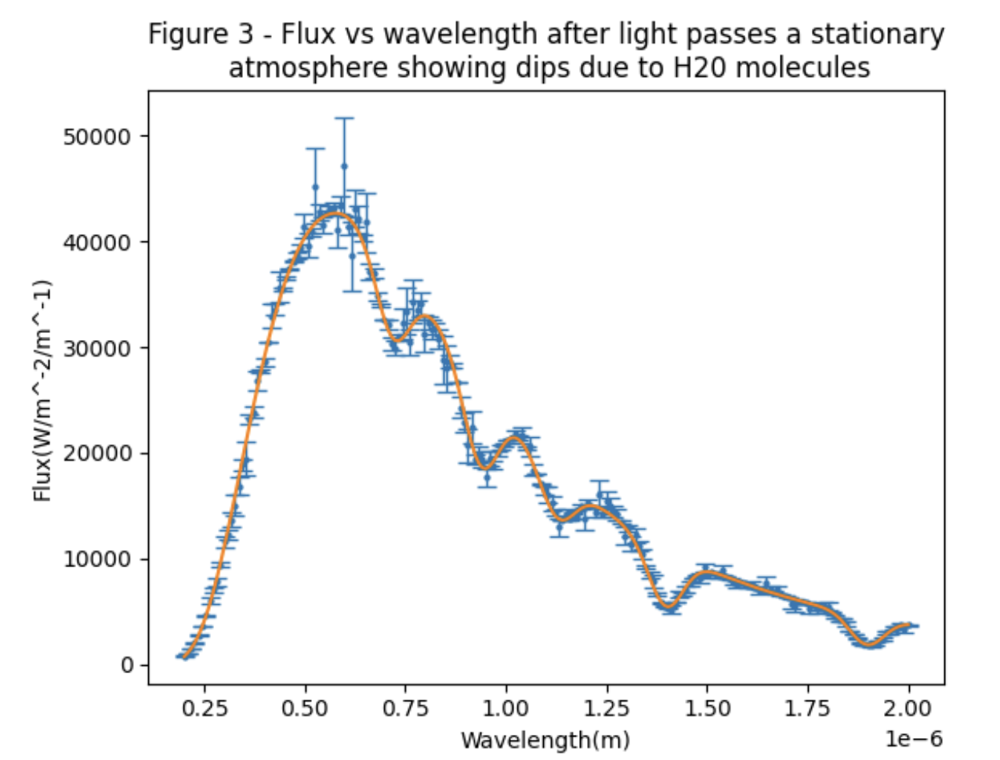
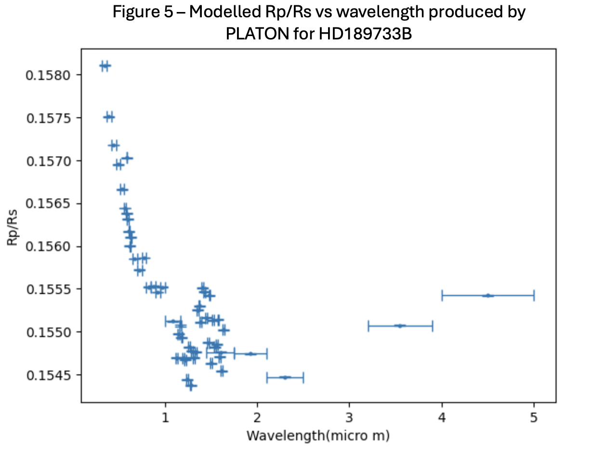
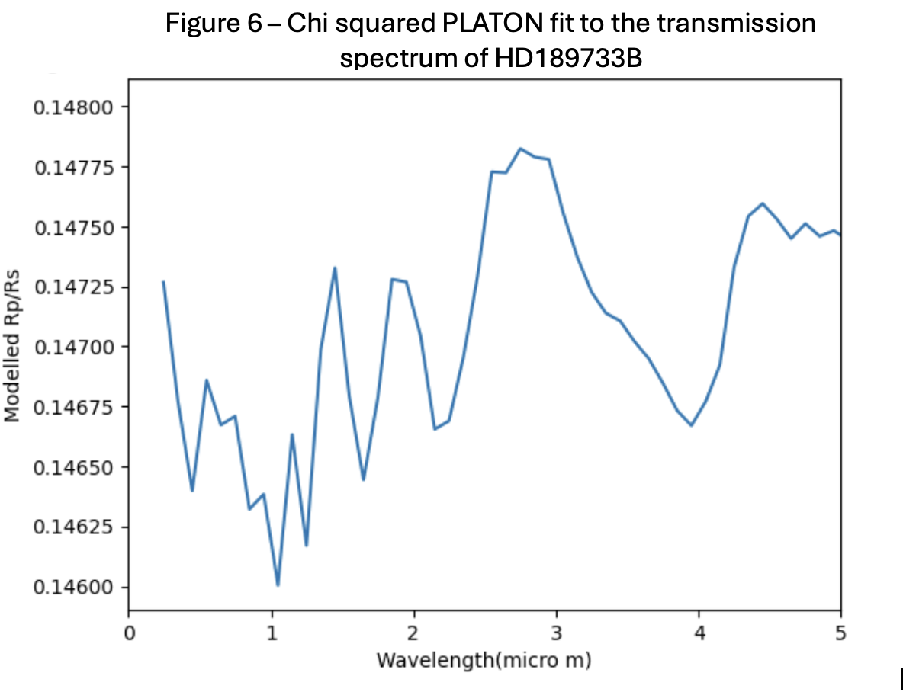

# Atmospheric Retrieval of the Hot Jupiter HD 189733b

In this project I will be investigating exoplanet transmission spectroscopy and atmospheric retrieval using python and the software platon. 

## Plan

This project explores how molecular absorption features can be observed in the atmospheres of exoplanets using transmission spectroscopy. 

First a model spectrum of light was created by plotting intensity against wavelength and injecting model absorption lines for different molecules. A second spectrum was then created to simulate light that had passed through a hot Jupiter by adding noise and doppler shifting the light. This exercise demonstrated the effect that uncertainties have in astrophysics and the need for high precision instruments to produce accurate results. Data collected from the exoplanet HD189733B was used to try to reproduce the results from the paper M. Oshagh (2020). This involved using the modelling package Platon from Zhang et al. (2019) to compare atmospheric models with the exoplanet's transmission spectrum and determine the expected and detected molecules within the atmosphere.

## Background Physics

As a planet orbits a star, eventually from our point of view the planet will pass infront of the star. This mean the light from the star will reduce in intensity as some will be blocked by the planet. But also some of light will pass through the planets atmosphere which will cause some wavelengths to be absorbed depending upon the molecules in the planets atmosphere. Electrons in atoms of a gas in the planets atmosphere have discrete levels so when the energy of a photon from a star matches the energy of a transition between levels, that photon will be absorbed which is what produces an absorption. As the planet orbits its star, it will also have a component of velocity radially towards or away from us. This causes the wavelength of light from the planet to be doppler shifted.

## Synthetic Transmission Spectroscopy

  
   
  <em>Figure 1. A graph showing the Planck distribution for flux against wavelength.</em>

A blackbody spectrum was first generated using Planck's law to approximate the stellar spectrum. This provided a baseline spectrum onto which atmospheric absorption features could be introduced.
  

  
   
  <em>Figure 2. Model stellar spectrum with simulated molecular absorption features introduced at selected wavelengths.</em>

Absorption features associated with H20 molecules were introduced into the model spectrum to simulate the wavelength dependent absorption produced as stellar light passes through an exoplanet atmosphere.
  

  
   
  <em>Figure 3. Simulated transmission spectrum with H₂O absorption features and Gaussian observational noise.</em>

Gaussian noise was then added to represent observational uncertainty.
  

  
   
  <em>Figure 4. Observed transmission spectrum of HD 189733b, showing the planet-to-star radius ratio as a function of wavelength.</em>

  
   
  <em>Figure 5. Model transmission spectrum of HD 189733b generated using PLATON.</em>

  
   
  <em>Figure 6. Best-fitting PLATON transmission spectrum obtained by minimising the chi-squared difference between the atmospheric model and observations.</em>

