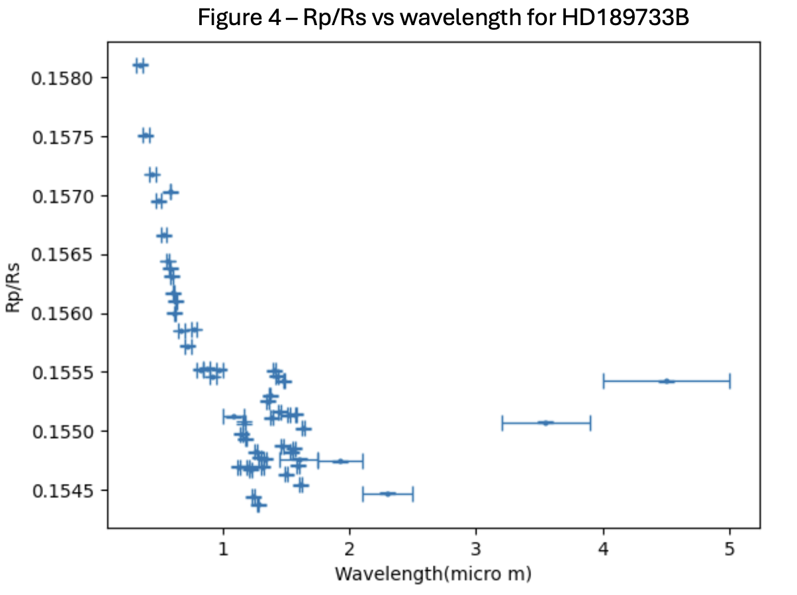
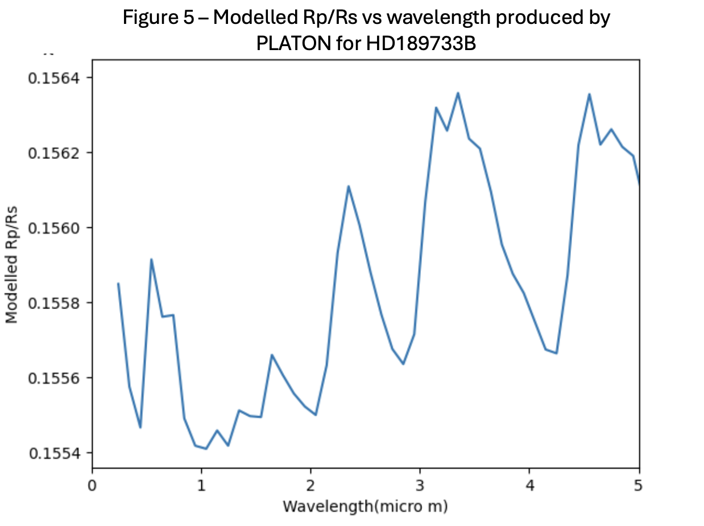

# Atmospheric Retrieval of the Hot Jupiter HD 189733b

In this project I will be investigating exoplanet transmission spectroscopy and atmospheric retrieval using python and the software platon. 

## Plan

This project explores how molecular absorption features can be observed in the atmospheres of exoplanets using transmission spectroscopy. 

First a model spectrum of light was created by plotting intensity against wavelength and injecting model absorption lines for different molecules. A second spectrum was then created to simulate light that had passed through a hot Jupiter by adding noise and doppler shifting the light. This exercise demonstrated the effect that uncertainties have in astrophysics and the need for high precision instruments to produce accurate results. Data collected from the exoplanet HD189733B was used to try to reproduce the results from the paper M. Oshagh (2020). This involved using the modelling package Platon from Zhang et al. (2019) to compare atmospheric models with the exoplanet's transmission spectrum and determine the expected and detected molecules within the atmosphere.

## Background Physics

As a planet orbits a star, eventually from our point of view the planet will pass infront of the star. This mean the light from the star will reduce in intensity as some will be blocked by the planet. But also some of light will pass through the planets atmosphere which will cause some wavelengths to be absorbed depending upon the molecules in the planets atmosphere. Electrons in atoms of a gas in the planets atmosphere have discrete levels so when the energy of a photon from a star matches the energy of a transition between levels, that photon will be absorbed which is what produces an absorption. As the planet orbits its star, it will also have a component of velocity radially towards or away from us. This causes the wavelength of light from the planet to be doppler shifted.

## Synthetic Transmission Spectroscopy

  
   
  <em>Figure 1. A graph showing the Planck distribution for flux against wavelength.</em>

In Figure 1, a blackbody spectrum was first generated using Planck's law to approximate the stellar spectrum. This provided a baseline spectrum onto which atmospheric absorption features could be introduced.
  

  
   
  <em>Figure 2. Model stellar spectrum with simulated molecular absorption features introduced at selected wavelengths.</em>

In Figure 2, absorption features associated with H2O molecules were introduced into the model spectrum to simulate the wavelength dependent absorption produced as stellar light passes through an exoplanet atmosphere.
  

  
   
  <em>Figure 3. Simulated transmission spectrum with H₂O absorption features and Gaussian observational noise.</em>

Then, in Figure 3, gaussian noise was then added to represent observational uncertainty.
  

  
   
  <em>Figure 4. Observed transmission spectrum of HD 189733b, showing the planet-to-star radius ratio as a function of wavelength.</em>

  
   
  <em>Figure 5. Model transmission spectrum of HD 189733b generated using PLATON.</em>

The PLATON model spectrum predicts an H20 absorption feature at approximately 1.4 μm, producing an increase in the planet to star radius ratio as the atmosphere becomes more opaque and the planet appears larger at these wavelengths. This feature is also visible in the observational data. Between approximately 0.3-1.2 μm, both the observed data in Figure 4 and the model in Figure 5 exhibit a declining slope which can be attributed to the Raleigh scattering behaviour expected in a clear sky. Further peaks in the model suggest the existence of CO2 and CH4 but there is limited data in this region so this cannot yet be confirmed. The peak at 1.9 μm is a second peak due to water, the peak leading up to 3.0 μm is likely due to methane and the peak at 4.4 μm is due to carbon dioxide.
  

  
   
  <em>Figure 6. Best-fitting PLATON transmission spectrum obtained by minimising the chi-squared difference between the atmospheric model and observations. The reduced chi squared for this graph was 17.1.</em>

In Figure 6, chi squared analysis was used to model the atmosphere of the hot Jupiter in comparison to the data from Figure 4. The metallicity, carbon to oxygen (C/O) ratio and cloud top pressure were varied with the PLATON model to minimise the difference between the model and observational data. The retrieval produced a metallicity of log(Z) = 1.47 ± 0.13, a C/O of 0.89 ± 0.01 and a cloud top pressure of approximately 15 mbar. In comparison to the paper by Zhang et al. (2020), who reported a C/O ratio of 0.64 ± 0.07 and a metallicity of 1.08 ± 0.22. And the paper by Lee et al. (2016) which found that the cloud top pressure was typically below 1 bar.

The reduced chi squared for this fit was approximately 17.1, which is higher than the desired value. This indicates that the resulting spectrum does not provide a statistically good fit to the observational data. However, it is likely due to the fact that there is limited data in the higher wavelength regime whereas the model from PLATON clearly suggests there would be strong peaks and dips in this region. Therefore, using data that covered a greater range of wavelengths would produce a graph that better matches the model produced by PLATON.
